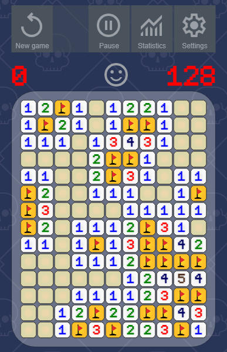
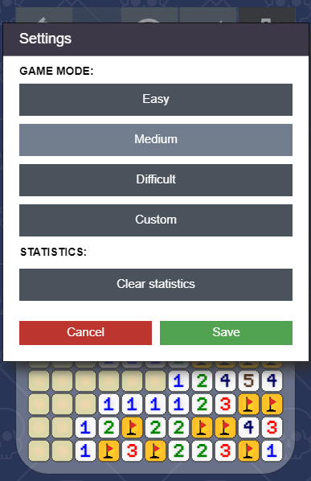

# Minesweeper
This game is online version of classic retro game Minesweeper.
It has been created to allow playing minesweeper in browser and mobile devices.
No special requirements are expected.
Any kind of device with access to the internet and simple input (mouse or touch screen) is enough. 
Features:
- different modes: easy / medium / difficult / custom
- in custom mode size of the board could be changed from popup
- statistics: best score for each mode separately
- pause option
- safe first click option
- no question mark option
- available on mobile devices

Online version:
[https://www.minesweeper-free.com](https://www.minesweeper-free.com/)

# How to run
1. To start in dev mode:
   npm run dev
2. To build production scripts:
   npm run build
3. To deploy to GitHub pages:
   npm run deploy

# Dependencies
npm install --save-dev @babel/types
